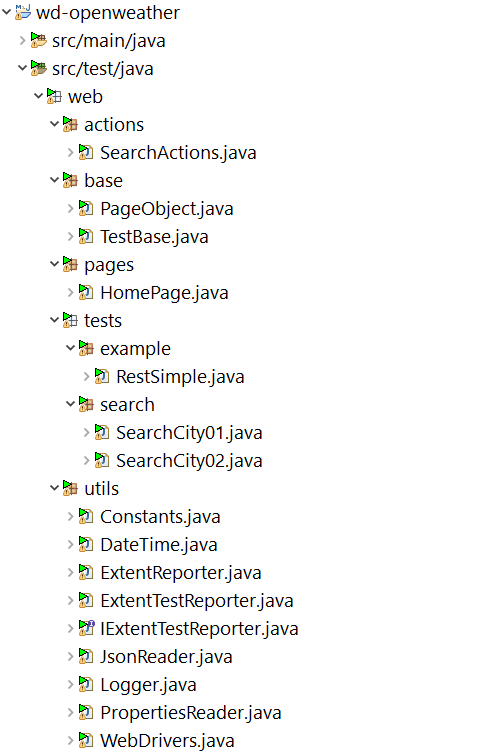

# wd-openweather
> The project is used for testing https://openweathermap.org/ web site 


## Table of Contents
* [General Info](#general-information)
* [Technologies Used](#technologies-used)
* [Features](#features)
* [Project Structure](#project-structure)
* [Setup](#setup)
* [Usage](#usage)
* [Continuous Integration](#continuous-integration)


## General Information
- A practice automation test framework based on Selenium and WebDriverManager using the Page Object Model pattern.


## Technologies Used
- Selenium - version 3.141.59
- TestNG - version 7.4.0
- ExtentReports - 5.0.9
- WebDriverManager - version 5.0.3
- Maven - version 3.8.4


## Features
- WebDriverManager helps running tests on cross-browsers (Chrome, Firefox) in headless mode 
- Run parallel tests with TestNG xml suites and Maven Surefire Plugin
- ExtentReports helps create beautiful, interactive and detailed reports with screenshots
- Maven builds a project using its project object model (POM) and a set of plugins


## Project Structure


## Setup
- Installing the JDK Software and Setting JAVA_HOME [here](https://docs.oracle.com/cd/E19182-01/821-0917/inst_jdk_javahome_t/index.html)
- Installing Apache Maven and Setting MAVEN_HOME, M2_HOME [here](https://maven.apache.org/install.html) 
- Installing Git [here](https://git-scm.com/downloads)
- Installing local Jenskin [here](https://www.jenkins.io/doc/book/installing/)


## Usage
- Clone the project from [GitHub](https://github.com/samquachhai/wd-openweather.git) to local directory
```javascript
git clone https://github.com/samquachhai/wd-openweather.git
```

- Go to the directory 
```javascript
cd wd-openweather
```

- Clean up project files: 
```javascript
mvn clean
```

- Run compile project : 
```javascript
mvn test-compile
```

- Run test with given suite name under folder test-suites (e.g. SearchCity01.xml) 
```javascript
mvn test -DsuiteXmlFile=SearchCity01.xml
```

- The ExtentReports test report is generated under /extent-report directory. 


## Continuous Integration
Running test from local Jenkins Pipeline.

- Create new Pipeline (e.g. wd-openweather) follow instructions [here](https://www.jenkins.io/doc/pipeline/tour/hello-world/#examples)

- Update the Pipeline script with below (Windows Command Prompt, replace 'bat' with 'sh' if you using Bash shell)

```javascript
pipeline {
    agent any
    stages {
        stage('Build') {
            steps {
                git branch: 'main', url: 'https://github.com/samquachhai/wd-openweather.git'
    
                bat label: 'Run mvn clean', script: 'mvn clean'
    
                bat label: 'Run test-compile', script: 'mvn test-compile'
    
                bat label: 'Run test', script: 'mvn test -DsuiteXmlFile=SearchCity01.xml'
            }
        }
    }
}
```

- Build Now


- PMD Code Analysis 
